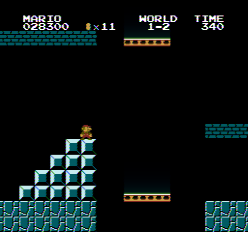

# 3P22Lambda

a CRT phosphor decay + afterglow simulator

https://user-images.githubusercontent.com/54422576/218102504-2b0da882-624d-47a1-a2a4-815c49da95ef.mp4

example processed video taken from [my NROM Scroller demo rom](https://github.com/Gumball2415/nes-scribbles/tree/main/nrom-scroller).

## About

todo: formalize this abstract
the majority of the phosphor decay lasts about 83 milliseconds (or 5-6 60FPS frames), with the effect of afterglow lasting up to 4 seconds. i haven't read much research on the topic of CRT phosphor afterglow, so i just really eyeballed the effect using [the luma coefficients of the Rec. 709 RGB primaries](https://www.itu.int/dms_pubrec/itu-r/rec/bt/R-REC-BT.709-6-201506-I!!PDF-E.pdf#page=6) as a base for the default values. lidnariq and zeta0134 has been measuring the decay response of individual color phosphors, but a phenomenon seems to occur when two or more colors glow much longer together than individually. (todo: link their findings when they post them online)

i also used real-life photographs of the SMB1 1-2 conveyor platforms as a reference to tune the strength and length of the decay and afterglow. (credits to zeta0134 for the idea!)

real life image of my CRT with the SMB falling platform:

emulator video processed with the simulator:


the decay is thus modeled here as two exponential decays, one short and one long. the short decay acts as the initial phosphor decay, while the long decay acts as the long weak afterglow.

```cpp
shortbuffer = std::max(in, (shortbuffer * (falloff / 60.0 * FPS)));
longbuffer = std::max(in, (longbuffer * (falloff / 60.0 * FPS)));
out = std::max((longbuffer * longfalloffmix), shortbuffer);
```

the default falloff values are calculated as:
```cpp
rp22_short = (0.2126 / 4.0);
gp22_short = (0.7152 / 4.0);
bp22_short = (0.0722 / 4.0);

rp22_long = (0.2126 / 10.0) + 0.1;
gp22_long = (0.7152 / 10.0) + 0.8;
bp22_long = (0.0722 / 10.0) + 0.9;

p22_long_mix = 0.01;
```

the default falloff values were optimized for 60FPS video, so i had to take that into account in order to make the falloff as a constant of time instead.

since P22 refers to a broad set of phosphors and not just 3, these decay times may vary depending on CRT monitor/display, and date of manufacturing.

each pixel of each input frame has red, green, and blue short and long falloff buffers (total of 6 floating point buffers per pixel). if multithreading is enabled, the program spawns a thread for each available core to speed up the process somewhat.

these values can be adjusted using additional commandline parameters. for more information, run `3P22Lambda.exe -h`.

this program was made with VS 2022 and CMake, hopefully the program can cross-compile under different platforms, but i can make no guarantee!

## License

this software is licensed under the [MIT-0 license](https://opensource.org/licenses/MIT-0).
this software uses LodePNG, under the [zlib license](https://opensource.org/licenses/Zlib), and Templatized C++ Command Line Parser Library, under the [MIT license](https://opensource.org/licenses/MIT).

## Thanks to:
 - Fiskbit, lidnariq, zeta0134, rainwarrior, and jekuthiel for discussion and idea
 - lidnariq for the short-long afterglow decay model
 - NewRisingSun for help/advice with color/gamut conversion

## Origin of name
the name is based on the P22 set of phosphors, used for CRT displays and monitors. 3 x P22 phosphor decay.
